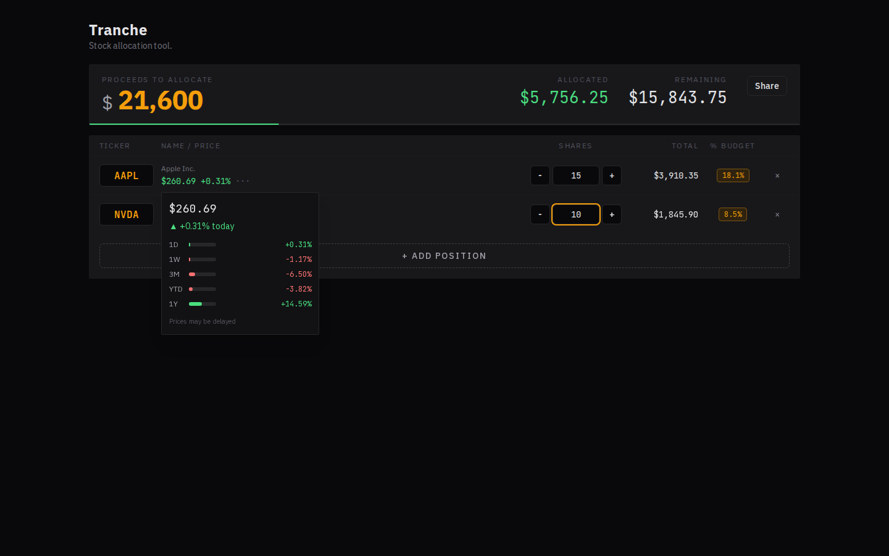

# Tranche

Stock allocation tool.

Tranche is a focused, no-login stock allocation workspace for planning position sizes and validating budget impact before placing trades.
Compared with typical brokerage dashboards or ad-heavy personal finance sites, it keeps only the essentials in view:
live quote checks, per-position sizing, budget tracking, and shareable scenario URLs.

## Preview

### Screenshot



### Quick demo video

[Download/watch demo video (WebM)](docs/assets/tranche-demo.webm)

<video controls src="docs/assets/tranche-demo.webm"></video>

## Local development

```bash
npm install
npm run dev
```

Open `http://localhost:3000`.

## Why Zustand here?

This app could be built with React Context + reducer, but Zustand is used for:

- Simpler global state with fewer provider wrappers.
- Built-in persistence middleware for the `tranche-session` localStorage key.
- Easier selective subscriptions as the table grows, reducing unnecessary rerenders.
